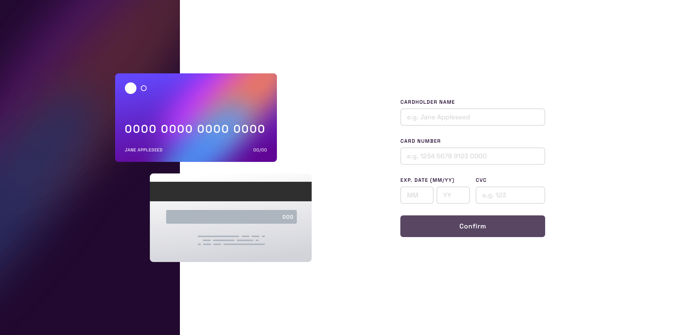

# Frontend Mentor - Swipable Todo App (Svelte/TailwindCss/localStorage)

This is a solution to the [Interactive card details form challenge on Frontend Mentor](https://www.frontendmentor.io/challenges/interactive-card-details-form-XpS8cKZDWw).

## Table of contents

- [Overview](#overview)
  - [The challenge](#the-challenge)
  - [Screenshot](#screenshot)
  - [Links](#links)
- [My process](#my-process)
  - [Built with](#built-with)
  - [Continued development](#continued-development)
  - [Useful resources](#useful-resources)
- [Author](#author)

## Overview

### The challenge

Users should be able to:

- Fill in the form and see the card details update in real-time
- Receive error messages when the form is submitted if:
  - Any input field is empty
  - The card number, expiry date, or CVC fields are in the wrong format
- View the optimal layout depending on their device's screen size
- See hover, active, and focus states for interactive elements on the page

### Screenshot

### Links

- Solution URL: [See solution here](https://www.frontendmentor.io/solutions/responsive-pageform-design-reactive-form-w-custom-validation-LrsnmKFfbH)
- Live Site URL: [See live site here](https://interactive-card-details-form-chi.vercel.app/)

## My process

### Built with

- Semantic HTML5 markup
- Grid
- Flexbox
- [SvelteKit](https://kit.svelte.dev/) - JS framework
- [TailwindCss](https://tailwindcss.com/) - Utility-first CSS framework
- [Typescript](https://www.typescriptlang.org/) - Strongly typed JS

### Continued development

The form validation logic was very fun to build with some good challenges.

I think my solution is pretty close to the original design but i have a problem with the way i managed the placement of the text in the reactive cards:

I used **CSS clamp** to keep the text in the right area as the cards change size but i discovered that the property is **not supported on Firefox mobile** (and maybe others that i could not test)

I would like to find a technique i could use for more compatibity while keeping the fluidity during the scaling.

### Useful resources

- [Scale type & space without breakpoints](https://utopia.fyi/) - Helps you generate clean clamp() functions based on you needs.

## Author

- Frontend Mentor - [@AntoineC-dev](https://www.frontendmentor.io/profile/AntoineC-dev)
